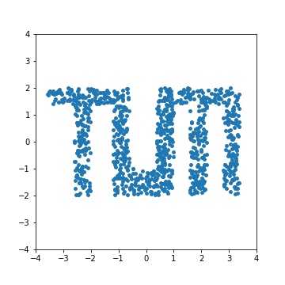
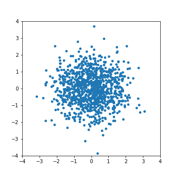
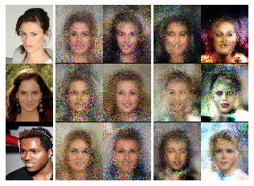

# Normalizing Flows

In this project, we implemented various normalizing flows in Tensorflow 2.0 and tested them on different datasets. 
Currently implemented flows are:
 
- Planar Flow [1]
- Radial Flow [1]
- Real NVP [2]
- Masked Autoregressive Flow (MAF) [3]
- Inverse Autoregressive Flow (IAF) [4]
- Neural Spline Flow [5] 

The implementations are located in [normalizingflows/flow_catalog.py](/normalizingflows/flow_catalog.py). 
For MAF, the Tensorflow implementation is used [6]. 
The MADE [7] network for modelling the shift and scale parameters can also be loaded from the flow catalog. 
Note that IAF can be obtained with the Tensorflow bijector inverse function, as described in the Tensorflow documentation [6].
Also important to note is that planar and radial flow do not admit an algebraic inverse.

The normalizing flows can be tested in terms of estimating the density on various datasets.
If an algebraic inverse is available, the flows can also be used as flow-based generative model.
[data/toy_data.py](/data/toy_data.py) contains various 2D toy data distributions on which the flows can be tested.
Additionally, data loading functions for three datasets from the UCI machine learning repository [8] (GAS, POWER, MINIBOONE),
MNIST, and CelebA are implemented in [data/dataset_loader.py](/data/dataset_loader.py). 
Details about how to download the data can be found in the respective files. 
The Dataset class in [data/data_manager.py](/data/data_manager.py) can be used as general data loader.

[example_training.ipynb](/example_training.ipynb) describes how to use normalizing flows to estimate the probability density function in a small tutorial.
As example Masked Autoregressive Flow is used to estimate the density of a 2D toy data distribution. 

The experiments folder contains experiments that we performed, including example heatmaps of approximated distributions and generated images from training on MNIST and CelebA.
Below we show some examples.

- Density estimation on toy data (left: ground truth, right: estimated density with MAF:

 

- Visualization how samples from a Gaussian base distribution are transformed through 8 layers of Real NVP to match the target distribution:

- Generated images from training on the classes "2", "4", "7", and "8" of the MNIST dataset (from left to right: ground truth, Real NVP, MAF)

- Generated images from training on the CelebA dataset (from left to right: ground truth, Real NVP, MAF)

As next steps, it would by interesting to implement more flows such as Neural Autoregressive Flows [9], Glow [10], and FFJORD [11].

This work was done during the large-scale machine learning practical course at the TUM Data Analytics and Machine Learning Group.
In case of any questions, feel free to reach out to us.

Murat Can Karacabey, muratcan.karacabey@tum.de

Markus Kittel, markus.kittel@tum.de

Lukas Rinder, lukas.rinder@tum.de

### References

[1] D. J. Rezende and S. Mohamed, “Variational inference with normalizing flows,” 32nd Int. Conf. Mach. Learn. ICML 2015, vol. 2, pp. 1530–1538, 2015.

[2] L. Dinh, J. Sohl-Dickstein, and S. Bengio, “Density estimation using Real NVP,” 2016.

[3] G. Papamakarios, T. Pavlakou, and I. Murray, “Masked autoregressive flow for density estimation,” Adv. Neural Inf. Process. Syst., vol. 2017-Decem, pp. 2339–2348, 2017.

[4] D. P. Kingma, T. Salimans, R. Jozefowicz, X. Chen, I. Sutskever, and M. Welling, “Improved variational inference with inverse autoregressive flow,” Adv. Neural Inf. Process. Syst., no. Nips, pp. 4743–4751, 2016.

[5] C. Durkan, A. Bekasov, I. Murray, and G. Papamakarios, “Neural Spline Flows,” no. NeurIPS, 2019.

[6] TensorFlow, “TensorFlow Documentation Masked Autoregressive Flow,” 2020. [Online]. Available: https://www.tensorflow.org/probability/api_docs/python/tfp/bijectors/MaskedAutoregressiveFlow. [Accessed: 28-Feb-2020].

[7] M. Germain, K. Gregor, I. Murray, and H. Larochelle, “MADE: Masked autoencoder for distribution estimation,” 32nd Int. Conf. Mach. Learn. ICML 2015, vol. 2, pp. 881–889, 2015.

[8] D. Dua and E. K. Taniskidou, “UCI: Machine Learning Repository.” [Online]. Available: http://archive.ics.uci.edu/ml/index.php. [Accessed: 29-Jan-2020].

[9] C. Huang, D. Krueger, A. Lacoste, and A. Courville, “Neural Autoregressive Flows,” arXiv Prepr., no. Icml, 2018.

[10] D. P. Kingma and P. Dhariwal, “Glow: Generative Flow with Invertible 1x1 Convolutions,” arXiv Prepr., 2018.

[11] W. Grathwohl, R. T. Q. Chen, J. Bettencourt, I. Sutskever, and D. Duvenaud, “FFJORD: Free-form Continuous Dynamics for Scalable Reversible Generative Models,” arXiv Prepr., 2018.

